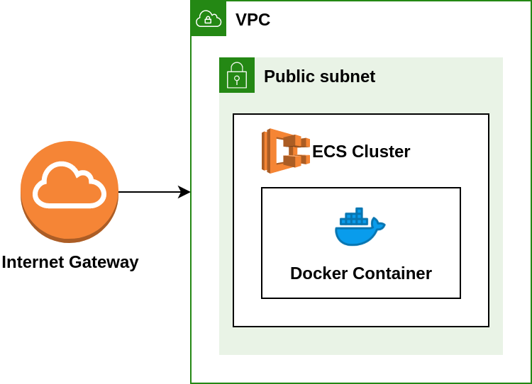
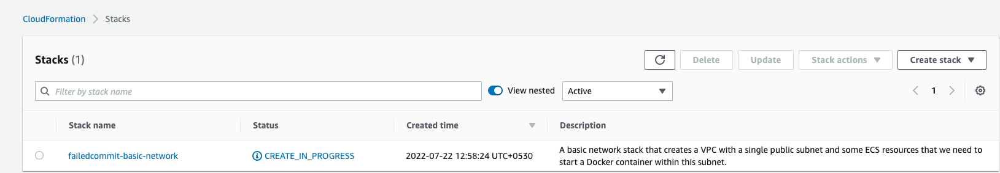
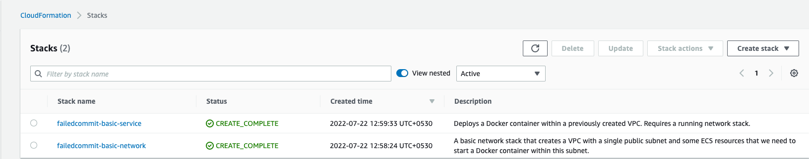

#### Using Cloudformation to create basic infrastructure and deploy the SpringBoot microservice.

## Network



```
$ cd cloudformation/notificationtemplateservice
$ ./create.sh
```


### Output on your AWS CLI

```
{
    "StackId": "arn:aws:cloudformation:us-east-1:123456789012:stack/failedcommit-basic-network/f202c560-098d-11ed-8138-0e9f7eff7c01"
}
{
    "StackId": "arn:aws:cloudformation:us-east-1:123456789012:stack/failedcommit-basic-service/19a197e0-098e-11ed-bb88-0a45554ca7f9"
}
ECS Cluster:        failedcommit-basic-network-ECSCluster-5pZDuVKfQqiw
ECS Task:           arn:aws:ecs:us-east-1:123456789012:task/failedcommit-basic-network-ECSCluster-5pZDuVKfQqiw/469951ecbd084ca7954e395950660a01
Network Interface:  eni-05fde46c4b9fc18ec
Public IP:          54.196.159.77
You can access your service at http://54.196.159.77:8080
```

### Verify on your AWS Account





:bangbang:  ###  NOTE  

You will get charged $$ for the time your network is up and running. 
You can delete by executing the below command and verify by going to Cloudformation section on your AWS account. 

```$ ./delete.sh```
