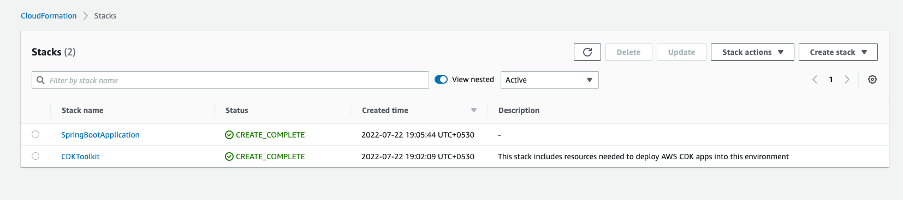

# Welcome to your CDK Java project!

This is a blank project for CDK development with Java.

The `cdk.json` file tells the CDK Toolkit how to execute your app.

It is a [Maven](https://maven.apache.org/) based project, so you can open this project with any Maven compatible Java
IDE to build and run tests.

#### Make Sure you have node JS installed. Use ``node -v`` to verify & check the installed version.

I have tested the code for latest node version i.e ```v18.8.0```

#### To install node you can run ```brew install node```

You will also need cdk to be installed on your local machine. Use ```npm install -g aws-cdk```
And ```cdk --version``` command can be used to verify and check the installed cdk version (mine is ```2.41.0```).
I am also using maven version ```3.8.6```

## Useful commands

* `./mvnw package`     compile and run tests
* `cdk ls`             list all stacks in the app
* `cdk synth`          emits the synthesized CloudFormation template
* `cdk deploy`         deploy this stack to your default AWS account/region
* `cdk diff`           compare deployed stack with current state
* `cdk docs`           open CDK documentation

* ` npm run bootstrap`  ✅ Only Once is enough

  Refer: https://docs.aws.amazon.com/cdk/v2/guide/bootstrapping.html

* `npm run repository:deploy` &
* `npm run repository:destroy`

Deploys and Destroys Docker Repository App for us. Check `package.json` for more commands.

### Study the below console Commands and their respective Output

```
🌺 npm run bootstrap

> notificationtemplateservice@1.0.0 bootstrap
> cdk bootstrap --app "./mvnw -e -q compile exec:java -Dexec.mainClass=com.myorg.BootstrapApp"

 ⏳  Bootstrapping environment aws://987337930789/us-east-1...
Trusted accounts for deployment: (none)
Trusted accounts for lookup: (none)
Using default execution policy of 'arn:aws:iam::aws:policy/AdministratorAccess'. Pass '--cloudformation-execution-policies' to customize.
CDKToolkit: creating CloudFormation changeset...
 ✅  Environment aws://987337930789/us-east-1 bootstrapped.

🌺 npm run network:deploy

> notificationtemplateservice@1.0.0 network:deploy
> cdk deploy --app "./mvnw -e -q compile exec:java -Dexec.mainClass=com.myorg.NetworkApp" --require-approval never


✨  Synthesis time: 4.83s

NetworkStack (staging-Network): building assets...

[0%] start: Building 8eea2eb585e1bf0db000a1eae0bc2cafaab13ff339dd4e1f773580239efab14b:987337930789-us-east-1
[100%] success: Built 8eea2eb585e1bf0db000a1eae0bc2cafaab13ff339dd4e1f773580239efab14b:987337930789-us-east-1

NetworkStack (staging-Network): assets built

NetworkStack (staging-Network): deploying...
[0%] start: Publishing 8eea2eb585e1bf0db000a1eae0bc2cafaab13ff339dd4e1f773580239efab14b:987337930789-us-east-1
[100%] success: Published 8eea2eb585e1bf0db000a1eae0bc2cafaab13ff339dd4e1f773580239efab14b:987337930789-us-east-1
staging-Network: creating CloudFormation changeset...

 ✅  NetworkStack (staging-Network)

✨  Deployment time: 239.23s

Stack ARN:
arn:aws:cloudformation:us-east-1:987337930789:stack/staging-Network/581fdea0-2f31-11ed-9e47-0e523b72cb63

✨  Total time: 244.05s

🌺 npm run repository:deploy

> notificationtemplateservice@1.0.0 repository:deploy
> cdk deploy --app "./mvnw -e -q compile exec:java -Dexec.mainClass=com.myorg.DockerRepositoryApp" --require-approval never


✨  Synthesis time: 5.34s

DockerRepositoryStack (notification-template-service-DockerRepository): building assets...

[0%] start: Building e567728b274a01594af323bc4db7471cab810c526e00d91fd637974e7c2cd967:987337930789-us-east-1
[100%] success: Built e567728b274a01594af323bc4db7471cab810c526e00d91fd637974e7c2cd967:987337930789-us-east-1

DockerRepositoryStack (notification-template-service-DockerRepository): assets built

DockerRepositoryStack (notification-template-service-DockerRepository): deploying...
[0%] start: Publishing e567728b274a01594af323bc4db7471cab810c526e00d91fd637974e7c2cd967:987337930789-us-east-1
[100%] success: Published e567728b274a01594af323bc4db7471cab810c526e00d91fd637974e7c2cd967:987337930789-us-east-1
notification-template-service-DockerRepository: creating CloudFormation changeset...

 ✅  DockerRepositoryStack (notification-template-service-DockerRepository)

✨  Deployment time: 38.81s

Stack ARN:
arn:aws:cloudformation:us-east-1:987337930789:stack/notification-template-service-DockerRepository/cd968f20-2f32-11ed-9dab-0e260fe472a5

✨  Total time: 44.15s

🌺 npm run service:deploy

> notificationtemplateservice@1.0.0 service:deploy
> cdk deploy --app "./mvnw -e -q compile exec:java -Dexec.mainClass=com.myorg.ServiceApp" --require-approval never


✨  Synthesis time: 6.17s

ServiceStack (staging-notification-template-service-Service): building assets...

[0%] start: Building 6e84dad4e2fbc869a5967934f3eb35db5fe5378e31ec3b242eb5a00c65c076b7:987337930789-us-east-1
[100%] success: Built 6e84dad4e2fbc869a5967934f3eb35db5fe5378e31ec3b242eb5a00c65c076b7:987337930789-us-east-1

ServiceStack (staging-notification-template-service-Service): assets built

ServiceStack (staging-notification-template-service-Service): deploying...
[0%] start: Publishing 6e84dad4e2fbc869a5967934f3eb35db5fe5378e31ec3b242eb5a00c65c076b7:987337930789-us-east-1
[100%] success: Published 6e84dad4e2fbc869a5967934f3eb35db5fe5378e31ec3b242eb5a00c65c076b7:987337930789-us-east-1
staging-notification-template-service-Service: creating CloudFormation changeset...
[████████████████████████████████████████████████▎·········] (10/12)

10:30:20 AM | CREATE_IN_PROGRESS   | AWS::CloudFormation::Stack                | staging-notificati...te-service-Service
10:30:57 AM | CREATE_IN_PROGRESS   | AWS::ECS::Service                         | ServiceStack/Service/ecsService

✅  ServiceStack (staging-notification-template-service-Service)

✨  Deployment time: 115s

Stack ARN:
arn:aws:cloudformation:us-east-1:987337930789:stack/staging-notification-template-service-Service/1dc9dec0-2f33-11ed-abd5-0ae549679743

✨  Total time: 121.17s

 ✅  SpringBootApplication

✨  Deployment time: 363.24s

Outputs:
SpringBootApplication.loadbalancerDnsName = prod-loadbalancer-580696646.us-east-1.elb.amazonaws.com
Stack ARN:
arn:aws:cloudformation:us-east-1:987337930789:stack/SpringBootApplication/eb92fad0-09cc-11ed-8c49-0aeeac31847b

✨  Total time: 372.42s
```

###Note

To setup the infra on a particular env, just pass the specific env name while deploying:

```npm run network:deploy -- -c environmentName=staging```

This way all the changes can be deployed and tested before moving to more sensitive environment, say, production.

### Verify

You can hit the <SpringBootApplication.loadbalancerDnsName>/notification-templates URL on the browser to see

```Hello From Cloudformation :-)```

Also, resources are created on AWS



:bangbang: Note

Don't forget to invoke ```cdk destroy``` when done. Leaving the infra running will cost money on hourly basis.

* `cdk destroy -c accountId=123456789012 -c region=us-east-1`

Without accountId and region params, the command will pick the default values configured in the CLI.

Enjoy!
